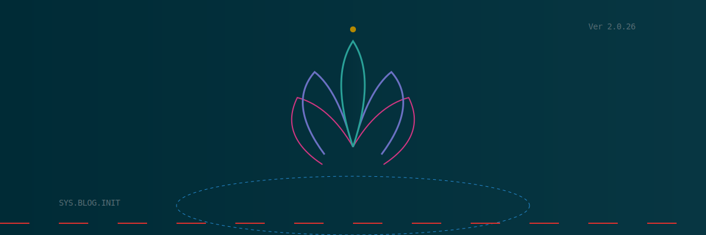

# Quickstart: Vigilant Meme Feature Specification Standards

**Feature**: 001-spec-template  
**Date**: 2026-02-06  
**Purpose**: Get started quickly with common tasks

## Prerequisites

- Python 3.8 or higher installed
- Git repository cloned locally
- Terminal access (PowerShell on Windows, bash on macOS/Linux)

## Setup

```bash
# Windows
py -3 -m pip install -r requirements.txt

# macOS/Linux
pip install -r requirements.txt
```

## Common Tasks

### 1. Create a New Blog Post

**Step 1**: Create file in `docs/blog/posts/`

```bash
# Create new post file
# Windows
New-Item -Path "docs/blog/posts/my-new-post.md" -ItemType File

# macOS/Linux  
touch docs/blog/posts/my-new-post.md
```

**Step 2**: Add required structure

```markdown
# My New Post Title

**Published: 2026-02-06**  
**Author: Your Name**

---

<div class="hero-container">
  
</div>

## Introduction

Your content here...

!!! tip "Pro Tip"
    Use admonitions to highlight important information.

!!! info "Did You Know?"
    This is an informational callout.
```

**Step 3**: Link from blog index

Edit `docs/blog/index.md` and add:

```markdown
### [My New Post Title](posts/my-new-post.md)

**Posted: February 6, 2026**

Brief description of your post.

[Read more →](posts/my-new-post.md)

---
```

**Step 4**: Verify locally

```bash
# Windows
py -3 -m mkdocs serve

# macOS/Linux
mkdocs serve

# Open http://127.0.0.1:8000/blog/
```

---

### 2. Modify Site Styling

**Step 1**: Edit CSS variables in `docs/stylesheets/extra.css`

```css
/* Light mode - add/modify in :root */
:root {
  --my-new-color: #hexvalue;
  --gradient-primary: linear-gradient(135deg, #start 0%, #end 100%);
}

/* Dark mode - add/modify in this selector */
[data-md-color-scheme="slate"] {
  --my-new-color: #dark-hexvalue;
  --gradient-primary: linear-gradient(135deg, #dark-start 0%, #dark-end 100%);
}
```

**Step 2**: Apply the variable

```css
.my-element {
  background: var(--my-new-color);
  /* Or use gradient */
  background: var(--gradient-primary);
}
```

**Step 3**: Add responsive override (if needed)

```css
@media (max-width: 768px) {
  .my-element {
    /* Mobile-specific styles */
    padding: 1rem;
  }
}
```

**Step 4**: Test both modes

1. Run `mkdocs serve`
2. Open site in browser
3. Toggle light/dark mode with header icon
4. Resize browser to test responsive

---

### 3. Update Navigation

**Step 1**: Edit `mkdocs.yml`

```yaml
nav:
  - Home: index.md
  - Blog:
    - blog/index.md
    - Posts:
      - Welcome Post: blog/posts/welcome.md
      - Getting Started: blog/posts/getting-started.md
      - My New Post: blog/posts/my-new-post.md  # Add new entry
  - Contact: contact.md
```

**Step 2**: Verify build

```bash
# Windows
py -3 -m mkdocs build --strict

# macOS/Linux
mkdocs build --strict
```

If successful, no output. If errors, check file paths exist.

---

### 4. Add a New Plugin

**Step 1**: Add to requirements.txt

```text
mkdocs>=1.6.0
mkdocs-material>=9.7.0
mkdocs-blog-plugin>=0.25
new-plugin-name>=1.0.0  # Add new plugin
```

**Step 2**: Install dependencies

```bash
# Windows
py -3 -m pip install -r requirements.txt

# macOS/Linux
pip install -r requirements.txt
```

**Step 3**: Configure in mkdocs.yml

```yaml
plugins:
  - search
  - new-plugin-name:
      option1: value
      option2: value
```

**Step 4**: Test locally

```bash
mkdocs serve
```

---

## Validation Checklist

Before committing changes, verify:

- [ ] `mkdocs build --strict` passes without warnings
- [ ] Site renders correctly in light mode
- [ ] Site renders correctly in dark mode  
- [ ] Mobile viewport (< 768px) looks correct
- [ ] All new images have alt text
- [ ] All internal links work
- [ ] Keyboard navigation works (Tab through page)

## Deployment

### GitHub Pages (Quick)

```bash
# Windows
py -3 -m mkdocs gh-deploy --force

# macOS/Linux
mkdocs gh-deploy --force
```

### Git Push (CI/CD)

```bash
git add .
git commit -m "Add new blog post: My New Post"
git push origin main
```

## Troubleshooting

| Issue | Solution |
|-------|----------|
| `mkdocs: command not found` | Use `py -3 -m mkdocs` on Windows |
| Build warning about broken link | Check file exists and path is correct |
| CSS not updating | Hard refresh browser (Ctrl+Shift+R) |
| Dark mode colors wrong | Check `[data-md-color-scheme="slate"]` selector |
| Admonition not rendering | Ensure `admonition` in `markdown_extensions:` |
